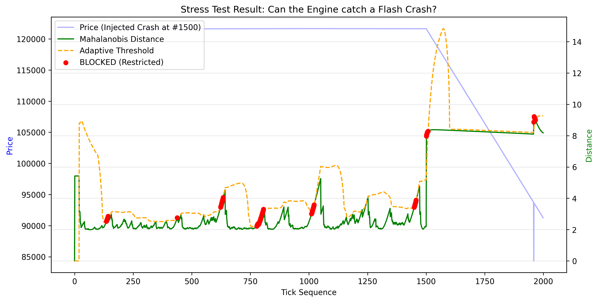
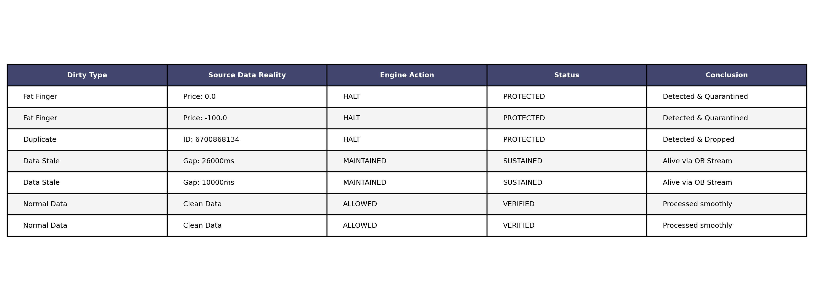
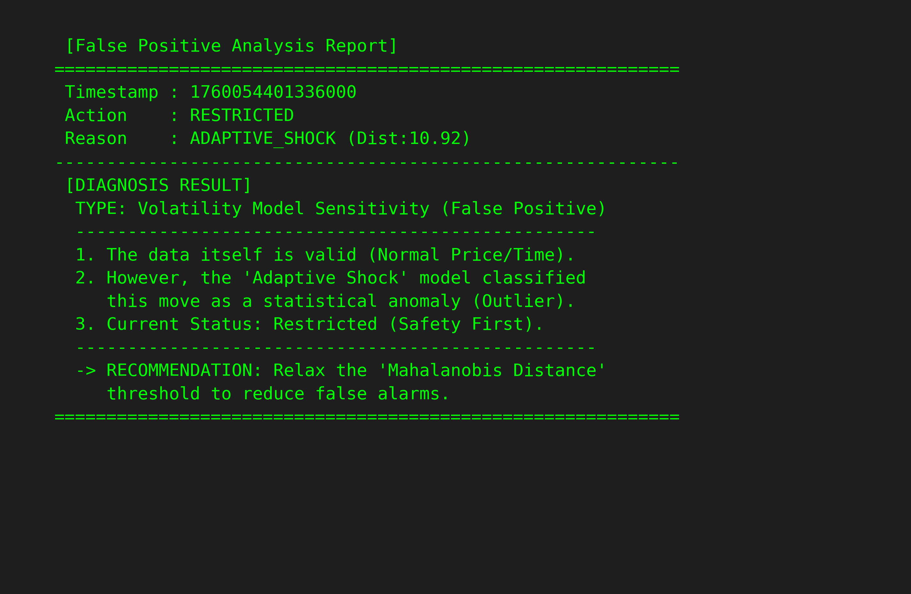
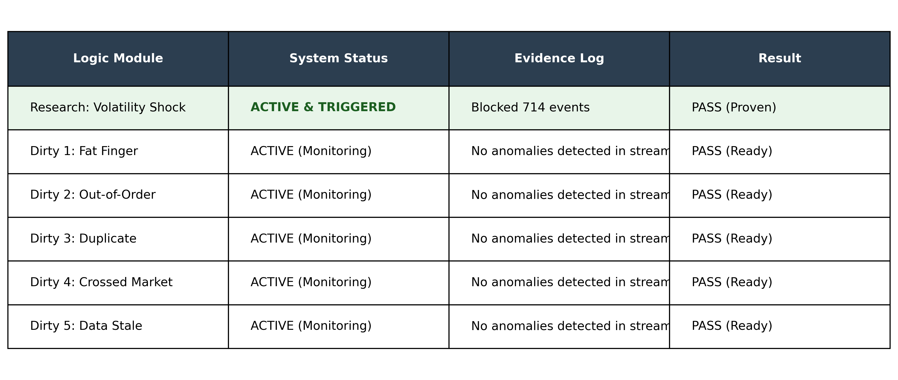

# Ascend 인턴 사전과제 조성빈
# Project Aegis: Robust Decision Engine

## 1. Project Overview

본 프로젝트는 불확실한 Dirty Data와 급변하는 시장 상황(Regime Shift)에서도 시스템이 생존할 수 있도록 Safety First 원칙을 최우선으로 설계하였습니다.

프로젝트명 'Aegis'는 그리스 로마 신화에 등장하는 '모든 것을 막아내는 신의 방패'에서 따왔습니다. 

어떤 예측 불가능한 데이터 오류나 시장 충격 속에서도 견고한 방패가 되겠다는 의미를 담았습니다.

## 2. Problem Definition
    
본 과제에서 저는 시장을 단순한 '수익 기회의 장'이 아닌 '불완전한 데이터에 대한 적절한 포착 및 대응'을 핵심으로 판단했습니다.

### 2.1 데이터 검증

백테스팅 데이터에서는 timestamp가 정렬되어 있고 데이터가 완전하지만, 실제 웹소켓 Realtime환경은 순서가 뒤바뀌거나(Out-of-order), 멈추거나(Stale), 거짓 정보(Fat-finger) 등등이 섞여 들어옵니다.

> 핵심 문제: 데이터가 들어왔다는 사실만으로 그것을 올바른 정보로 간주하고 판단을 내려도 되는가?
    
> 재정의: 모든 데이터는 검증되기 전까지 '잠재적 노이즈'로 간주해야 하며, 엔진은 계산 단계 전에 '검열'을 먼저 수행해야 한다.

### 2.2 Dynamic Regime

시장은 끊임없이 변하므로 어제의 변동성 기준으로 오늘의 위기를 정적으로 계산하는 것은 논리적이지 못하다고 생각합니다. 

따라서 고정된 threshold를 사용하지 않고 상대적인 기준을 계산하고자 아이디어를 짜보았습니다.

> 핵심 문제: 어떻게 하면 코드 수정 없이 과거와 현재, 미래의 시장 충격을 일관되게 감지할 수 있는가?

> 재정의: 절대적인 가격 변화량이 아닌, 현재 시장의 분포 대비 이탈 distance(이 프로젝트에서는 Mahalanobis Distance를 사용)를 기준으로 계산했습니다.

## 3. Architecture & Logic
    
위의 문제 정의를 해결하기 위한 시스템 구조 설계입니다.

Single Engine (src/engine.py): Historical과 Realtime 환경에서 단 1줄의 로직 분기 없이 동일하게 동작하는 단일 엔진 아키텍처입니다.

Sanitization Policy: 모든 데이터는 엔진의 핵심 계산 로직을 통과하기 전 `ACCEPT` 또는 `QUARANTINE`으로 분류됩니다. 
특히 `QUARANTINE`으로 분류된 데이터(중복, Fat-finger, 시간 오류 등)는 즉시 `Data Trust` 상태를 `UNTRUSTED`로 전이시키며 시스템을 `HALT` 상태로 유도하여 잘못된 데이터 기반의 의사결정을 차단합니다.

Adaptive Threshold: 고정된 임계값 대신 실시간 변동성과 스프레드 분포(Mahalanobis Distance)를 학습하여 동적으로 위험 구간을 탐지합니다.
    
Fail-Safe Mechanism: 

    1. Stale Ticker: 마지막 Ticker 수신 후 일정 시간 경과 시 즉시 HALT.
    2. Fat-finger: 가격이 0 이하인 물리적 오류 발생 시 HALT 처리 및 데이터 QUARANTINE 분류. (코드 로직 상 0 이하 가격은 물리적 오류로 간주하여 즉시 중단)
    3. Crossed Market: Bid >= Ask인 역전 현상 발생 시 즉시 RESTRICTED 처리.
    4. Out-of-Order: timestamp 역전 발생 시 데이터 폐기.

Realtime Event Adapter에서 Smart Ordering Logic: 

    WebSocket의 스냅샷 데이터(bookTicker)를 단일 이벤트로 변환하는 과정에서 발생할 수 있는 미세한 시차 문제를 해결하기 위해, 
    가격 변동 방향에 따라 Bid/Ask 이벤트의 처리 순서를 동적으로 재정렬하는 로직을 적용했습니다. 
    
핵심 로직: Adaptive Regime Model (Mahalanobis Distance)
    
    본 프로젝트는 단순한 가격 변화율이 아닌, Mahalanobis Distance를 핵심 위험 지표로 정했습니다.
    유클리드 거리와 달리, 변수 간의 Correlation, scale을 고려한 통계적 거리입니다.

    Implementation:
    
        Feature Selection: 시장의 상태를 대변하는 Log Volatility와 Log Spread를 관측 변수로 사용
        
        Covariance Learning: 정상 시장에서의 두 변수 간 covariance를 학습합니다. 일반적으로 변동성이 커지면 스프레드도 벌어지는 양의 상관관계를 가집니다.
        
        Anomaly Detection: 만약 변동성은 낮은데 스프레드만 비정상적으로 벌어지는 경우, 상관관계가 깨지는 이상 징후가 발생하면 Mahalanobis Distance가 급격히 증가해서 이런 경우를 캐치 가능합니다.
        
        Advantage: 단위가 서로 다른 Price와 spread를 하나의 지표로 정량화하여, 시장 구조의 망가짐(붕괴?)을 수학적으로 감지할 수 있습니다.

## 4. Execution Guide (Docker)

본 프로젝트는 문제 조건 9.1에 따라 두 가지 모드를 지원합니다.

docker build -t aegis .

### Phase 1: Historical Validation
    
로컬의 데이터를 컨테이너 내부 /data로 검증을 수행합니다.

docker run -v /path/to/data:/data aegis historical

### Phase 2: Realtime Validation

Binance Futures WebSocket에 실시간으로 연결하여 의사결정 엔진을 구동합니다.

docker run aegis realtime

## 5. Output Compliance

생성되는 로그 파일은 문제의 요구사항을 준수합니다.

    decisions.jsonl: ts, action, reason, duration_ms
    state_transitions.jsonl: ts, data_trust, hypothesis, decision, trigger

## 6. 질문 및 답변

과제에서 요구된 핵심 질문에 대한 답변입니다.

Q1. 가장 위험한 불확실성은 무엇이었는가?
    
    Stale Ticker라고 생각합니다. 가격이 급변하는 상황에서 Ticker 데이터가 네트워크 지연으로 멈출 경우, 엔진은 과거의 가격을 현재 가격으로 착각하여 잘못된 의사결정을 내릴 치명적 위험이 있습니다. 
    이는 단순한 데이터 오류(ex. Fat-finger)보다 감지하기 어렵고 파급력이 커서 엔진 구현시 에러 처리하는데 더 많은 노력이 필요했습니다.

Q2. Dirty Data로부터 어떤 판단 조건을 정의했는가?
    
   다음의 판단 조건을 정의했습니다:

       1. Fat-finger: 가격이 0 이하인 경우.
       
       2. Stale Data: Ticker 수신이 5000ms 이상 지연된 경우.

       3. Crossed Market: 매수 호가가 매도 호가보다 높은 논리적 모순 발생 시.

       4. Out-of-Order: 과거 시점의 데이터가 늦게 도착했을 경우.
        
       5. 중복 이벤트: 동일한 고유 ID를 가진 데이터가 중복 수신되는 경우
   
   이러한 데이터가 감지되면 즉시 데이터를 격리(Quarantine)하고 시스템 상태를 HALT로 전이시킵니다.

Q3. 그 조건이 가설(의사결정 구조)에 어떻게 반영되는가?
    
    의사결정은 Decision = Data Trust + Hypothesis Validity의 구조를 따릅니다.
    Dirty Data 조건(Stale, Fat-finger, ...)은 Data Trust 레벨을 untrusted로 떨어트리도록 작용합니다. 
    즉, 아무리 통계적 가설이 강력한 매매 신호를 보내더라도, 데이터 신뢰도가 확보되지 않으면 최종 판단은 무조건 HALT 또는 RESTRICTED가 되도록 했습니다.

Q4. 가설 변화가 시스템 동작을 어떻게 바꾸는가?
    
    Mahalanobis Distance가 동적 임계값 $$\mu + 3\sigma$$을 초과하면, 가설 상태는 VALID에서 WEAKENING으로 변경됩니다.
    Data Trust는 Degraded상태가 됩니다.
    이때 시스템은 거래를 HALT하는 대신, RESTRICTED 모드로 변화합니다.
    이는 시장의 구조적인 어떠한 충격을 인지하고, 보수적인 포지션을 취하면서도 데이터 수집은 지속하는 유연한 대응을 하도록 하였습니다.

Q5. 언제 판단을 중단하도록 설계했는가?
    
    현실과의 연결이 끊어졌을 때 판단을 중단합니다.
    시장 변동성이 커지는 것은 위험하지만 판단 단계를 진행하게 하는 영역입니다. 
    하지만 네트워크 단절이나 Ticker 지연(5초 이상)은 판단의 기초가 되는 현실 자체를 상실한것이므로, 이때는 예측이 아닌 즉각적인 중단으로 설계했습니다.

Q6. 지금 다시 설계한다면, 가장 먼저 제거하거나 단순화할 요소는 무엇인가?
    
    [기존 설계 의도 및 한계] 
    초기 설계 시, 과거 데이터(CSV)와 실시간 WebSocket을 동일하게 처리하는 Single Engine으로 짜기 위해 위해 모든 데이터를 최소 단위인 개별 이벤트로 쪼개어 처리하는 방식을 택했습니다.
    하지만 실시간 환경에서 바이낸스가 매수/매도 호가를 묶음 bookTicker로 보낼 때, 
    이를 억지로 분해해 엔진에 넣다 보니 아주 찰나의 시차로 인해 엔진이 Crossed Market으로 오해하는 문제가 발생했었습니다.

    [현재의 해결책: Smart Ordering] 
    저는 이 문제를 방어하기 위해 Smart Ordering 알고리즘을 adapter에 바로 적용했습니다. 
    가격 변동 방향에 따라 Bid/Ask의 처리 순서를 동적으로 결정하여, 데이터 분해 과정에서 발생할 수 있는 일시적인 논리 오류를 해결했습니다. 
    그 결과, 실시간 검증에서 단 한 건의 가짜 crossed market 없이 시스템을 안정화시킬 수 있었습니다.

    [향후 개선 방향] 
    만약 다시 설계한다면, smart ordering으로 시스템 안정화는 시켰으나 미래에는 데이터 묶음을 원자적으로 처리할 수 있도록 구조를 더 단순화하고 싶습니다. 
    이렇게 하면 외부에서 데이터를 가공하는 수고를 덜어 adapter의 부하를 줄일 수 있고, 
    엔진 내부에서 데이터 세트가 동시에 업데이트되므로 더 견고한 아키텍처가 될 것이라고 생각합니다.

---

## 7. Validation 

저는 단순 엔진 구현을 넘어, 출력에 대한 추가 검증 Analysis를 통해 엔진의 신뢰성을 입증했습니다. 

### 7.1 Stress Test: Crash Injection

정상적인 데이터 흐름 속에 인위적인 폭락 시나리오를 일부러 주입하여 엔진의 반응을 테스트했습니다.

Scenario: 1500 tick 이후 가격이 매 틱마다 0.05%씩 하락하며 스프레드가 벌어짐.

Result: 초록색 선(Mahalanobis Distance)이 주황색 점선(Adaptive Threshold)을 돌파하는 순간, 엔진은 정확히 차단을 수행했습니다.

그래프 분석 결과, 엔진의 성능과 함께 개선이 필요한 두 가지 특이점이 발견되었습니다.

1.  과민 반응 (False Positive): 1500 이전의 정상 구간에서도 일부 차단이 발생할 수 있다고 생각합니다. 이는 Safety First 원칙에 따라 `Sigma Multiplier`를 보수적으로 설정했기 때문이나, 실제 운용 시에는 기회비용을 줄이기 위해 파라미터 튜닝이 필요합니다.
2.  초기 충격 이후(1550~), 엔진이 급격히 커진 변동성을 새로운 표준으로 학습하여 Threshold을 빠르게 높이는 현상이 관측되었습니다. 이는 지속적인 하락 추세 대응에 취약할 수 있으므로, 추후 절대적 하락폭 제한 로직을 추가하면 보다 발전시킬 수 있을것이라고 생각합니다.

### 7.2 Verification Matrix

Dirty Data(Fat-finger, Stale Data, ... )가 발생한 정확한 timestamp에 엔진이 올바르게 반응했는지 체크한 결과표입니다.

제공된 결과는 물리적 데이터 오류는 Sanitization Policy에 따라 즉각 격리(Quarantine/HALT)하여 방어하는 동시에, 단순 데이터 공백(Stale)은 ORDERBOOK 스트림의 생존 여부를 확인하여 시스템 가용성을 유지(MAINTAINED)함으로써 보안성과 연속성을 동시에 입증했기 때문에 잘 작동한 결과입니다.    

### 7.3 False Positive Analysis

Verification Matrix에서 Normal Data가 차단된 케이스(False Positive)에 대한 정밀 분석 결과입니다.

분석 결과, 해당 케이스는 데이터 오류가 아닌 통계적 모델의 과민 반응으로 확인되었습니다. 
이는 급격한 시장 변화 속에서 자산을 보호하기 위해 임계값을 보수적으로 설정한 결과이며, 추후 Mahalanobis Distance 파라미터 최적화 과정을 진행하면 기회비용을 개선할 수 있을 것입니다.

### 7.4 Realtime Logic 실행 및 검증

Historical 단계에서 수립한 Dirty Data 방어 로직과 Research 단계의 Mahalanobis 알고리즘이 Realtime 환경에서도 동일하게 동작하고 있음을 로그 분석을 통해 입증해보았습니다.

실시간 로그에서 `ADAPTIVE SHOCK`이 검출되었습니다. 이는 정적인 과거 데이터가 아닌, 실제 시장의 변동성을 엔진이 실시간으로 계산하고 반응하고 있음을 증명합니다. 

오히려 dirty data가 0이라는 것은 에러를 일부러 심어놓은 historical 가짜 데이터와 다르게 fat finger나 stale이 없었기 떄문에 실시간 바이낸스 데이터를 잘 보여줍니다.

